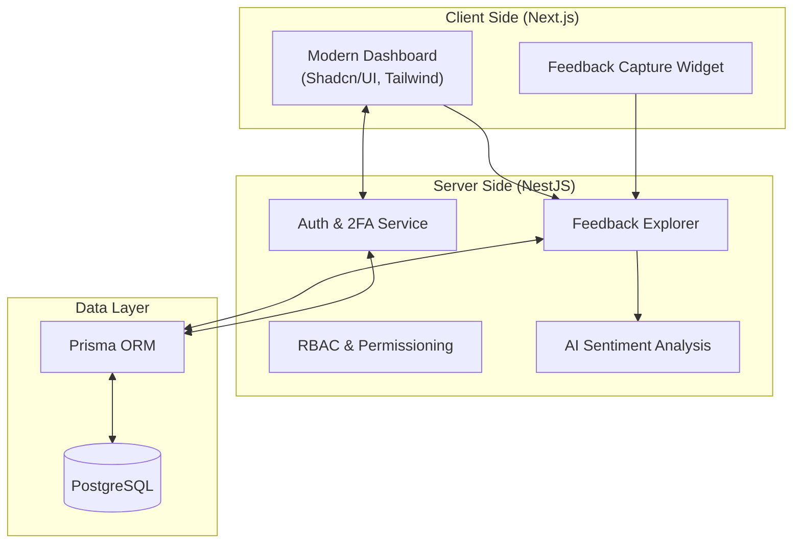

# 🎙️ VoiceFirst

**Empowering Customer Voice through High-Fidelity Feedback & AI-Driven Insights**

[](https://opensource.org/licenses/MIT)
[](https://nestjs.com/)
[](https://nextjs.org/)
[](https://www.prisma.io/)

VoiceFirst is a modern, enterprise-ready feedback management platform built to capture, analyze, and act on customer feedback. With a focus on security, scalability, and AI-enhanced sentiment analysis, VoiceFirst bridges the gap between raw feedback and actionable business intelligence.

---

## 🏛️ System Architecture



---

## ✨ Key Features

-   **🔐 Robust Security**: 
    -   JWT-based Authentication.
    -   Integrated **Two-Factor Authentication (2FA)** for secure accounts.
    -   Granular **RBAC (Role-Based Access Control)** for staff and administrators.
-   **📊 Feedback Explorer**: 
    -   Real-time feedback monitoring.
    -   Integrated metadata capture (Device, Browser, Geolocation).
-   **🤖 AI Sentiment Analysis**: 
    -   Automatically categorize customer sentiment (Positive, Negative, Neutral).
    -   Extract key themes related to "Loved" or "Criticized" traits.
-   **📍 Multi-Touchpoint Management**:
    -   Organize feedback by branch, department, or specific interaction points.
-   **🎨 Modern UI/UX**:
    -   Clean, dark-mode-ready interface built with Next.js 14 and Tailwind CSS.
    -   Smooth framer-motion animations for a premium feel.

---

## 🚀 Tech Stack

### Backend
-   **NestJS**: Progressive Node.js framework for efficient, scalable server-side applications.
-   **Prisma**: Next-generation ORM for Node.js and TypeScript.
-   **PostgreSQL**: Reliable, powerful open-source relational database.
-   **Passport.js**: Authentication middleware for security strategies.

### Frontend
-   **Next.js**: The React framework for the web.
-   **Tailwind CSS**: Utility-first CSS framework for rapid UI development.
-   **Shadcn/UI**: Highly customizable components built on Radix UI.
-   **Lucide Icons**: Beautifully simple, pixel-perfect icons.

---

## 🛠️ Getting Started

### Prerequisites
-   Node.js (v18+)
-   npm or yarn
-   PostgreSQL instance

### Installation

1.  **Clone the repository**:
    ```bash
    git clone https://github.com/NAVEEN78100/VoiceFirst.git
    cd VoiceFirst
    ```

2.  **Environment Setup**:
    -   Create a `.env` in the root folder for the backend.
    -   Create a `.env` in the `/frontend` folder for the Next.js app.
    -   Refer to `.env.example` in both directories.

3.  **Install Dependencies**:
    ```bash
    # Root (Backend) dependencies
    npm install

    # Frontend dependencies
    cd frontend
    npm install
    cd ..
    ```

4.  **Database Migration**:
    ```bash
    npx prisma migrate dev
    ```

5.  **Run the Project**:
    ```bash
    # Run Backend (Root)
    npm run dev

    # Run Frontend (in /frontend folder)
    cd frontend
    npm run dev
    ```

---

## 📜 License

This project is licensed under the MIT License - see the [LICENSE](LICENSE) file for details.

---

Developed with ❤️ by the **VoiceFirst Team**.
