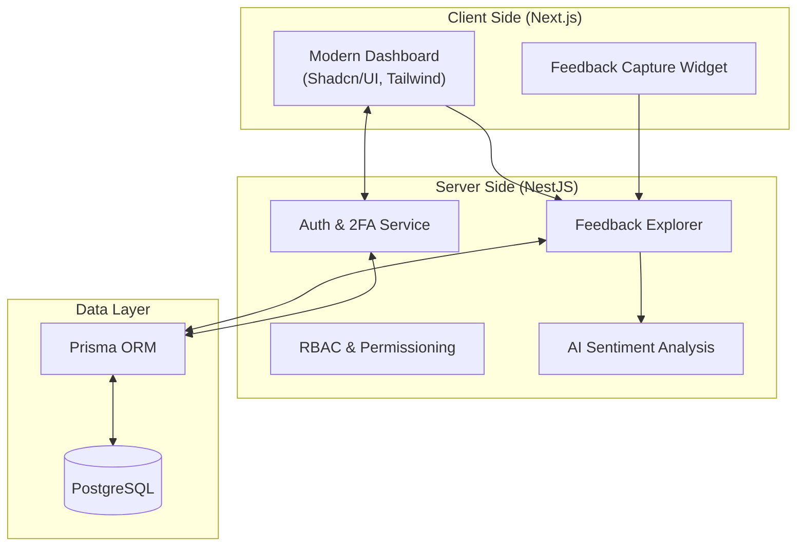

<div align="center">

# 🎙️ VoiceFirst

#### **Empowering Customer Voice through High-Fidelity Feedback & AI-Driven Insights**


---

</div>

## 🧠 What is VoiceFirst?

**VoiceFirst** is an enterprise-grade feedback management platform designed to capture and analyze the "voice" of your customers in real-time. It transforms raw data into actionable business intelligence using cutting-edge AI and robust data architectures.

-   **📡 Real-Time Feedback Collection** — Capture ratings and reviews instantly across multiple touchpoints.
-   **🔐 2FA & RBAC Security** — Enterprise-level protection with Two-Factor Authentication and granular Role-Based Access Control.
-   **🤖 AI Sentiment Analysis** — Auto-detect customer mood (Positive / Negative / Critical) and extract key loved/criticized traits.
-   **📍 Multi-Touchpoint Routing** — Track feedback specifically for individual branches, departments, or staff members.
-   **🌓 Modern Fluid UI** — A premium, responsive dashboard experience built with Next.js 14 and Shadcn/UI.
-   **📈 Advanced Analytics** — Visualize feedback trends with dynamic charts and geographic metadata (IP, Location, Browser).

---

## 🏛️ System Architecture



---

## 🚀 Quick Setup

### 1. Prerequisites
-   Node.js (v18+)
-   PostgreSQL

### 2. Installation
```bash
# Clone the repository
git clone https://github.com/NAVEEN78100/VoiceFirst.git
cd VoiceFirst

# Install Backend dependencies
npm install

# Install Frontend dependencies
cd frontend
npm install
cd ..
```

### 3. Environment Config
Copy `.env.example` to `.env` in both the root and `frontend/` folders and fill in your credentials:
-   `DATABASE_URL` (PostgreSQL)
-   `JWT_SECRET`
-   `2FA_APP_NAME` (VoiceFirst)

### 4. Launch
```bash
# Run Database Migrations
npx prisma migrate dev

# Start development servers
# (Root for Backend, /frontend for Frontend)
npm run dev
```

---

## 🎨 Design Principles
-   **Premium Aesthetics**: Curated HSL color palettes and smooth gradients.
-   **Accessibility First**: Full Keyboard navigation and screen reader support.
-   **Micro-Animations**: Subtle hover effects and state transitions using Framer Motion.

---

<div align="center">

Developed with ❤️ by the **VoiceFirst Team**.
[Website](#) • [Support](#) • [Documentation](#)

</div>
