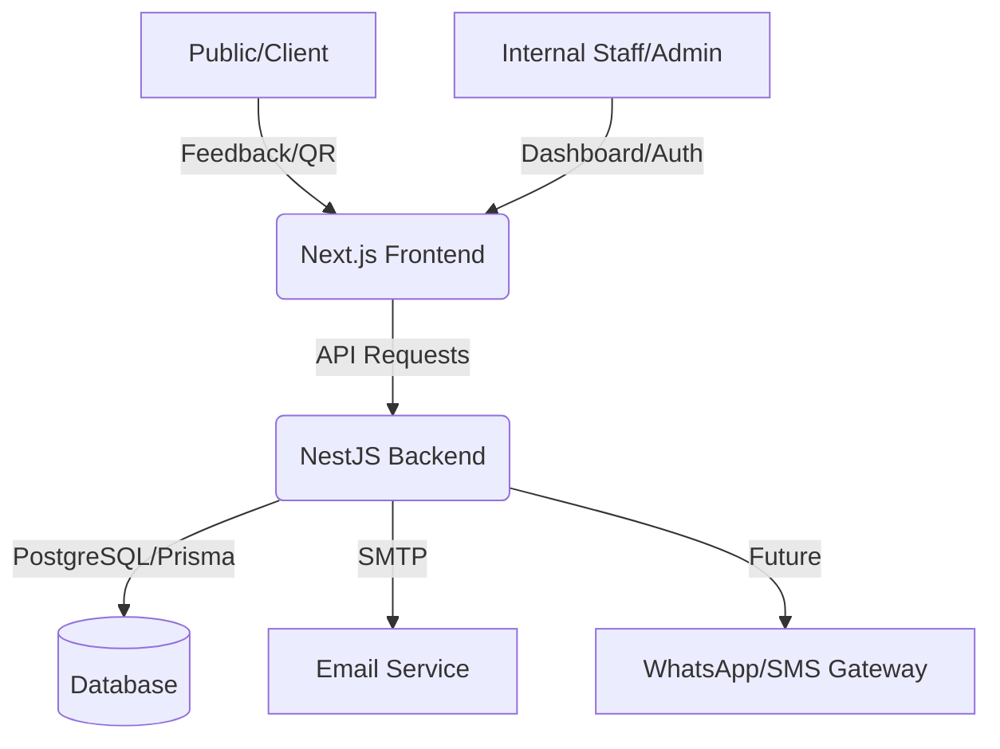

# 🗣️ VoiceFirst Platform

[](https://nestjs.com/)
[](https://nextjs.org/)
[](https://www.prisma.io/)
[](https://www.postgresql.org/)

**VoiceFirst** is a production-grade Feedback & Case Management ecosystem designed for enterprise service touchpoints (Branches, ATMs, Staff). It enables real-time feedback capture via QR codes, automated escalation for negative experiences, and deep analytics for management.

---

## 🌟 Key Features

### 🔐 Advanced Security & Auth
*   **RBAC (Role-Based Access Control):** Granular permissions for ADMIN, CX, MANAGER, and STAFF.
*   **Dual-Factor Authentication:** Support for TOTP (Authenticator Apps) and Email OTP.
*   **Security Hardening:** Brute-force protection, hashed recovery codes, and JWT-based sessions.
*   **Audit Logging:** Comprehensive tracking of login attempts and critical system actions.

### 📊 Feedback & Touchpoints
*   **Dynamic Touchpoints:** Manage physical locations (Branches), digital assets (ATMs), or specific Staff members.
*   **QR-Powered Capture:** Tokenized survey links for secure, anonymous, or identified feedback.
*   **Sentiment Tracking:** 1-5 rating system with text comment support.

### 🛠️ Case Management (Auto-Escalation)
*   **Automated Triggers:** Low ratings (1-2) automatically generate "Cases" with priority levels.
*   **Recovery Workflow:** Track follow-ups, resolution status, and "Recovery Delta" (improvement in satisfaction).
*   **Escalation Matrix:** Notifications sent to Branch Managers or CX teams based on priority.

---

## 🏗️ Architecture



---

## 🚀 Quick Start

### 1. Prerequisites
- **Node.js** >= 18
- **PostgreSQL** instance
- **npm** >= 9

### 2. Backend Setup (Root)
```bash
# Install dependencies
npm install

# Setup Environment
cp .env.example .env
# Update .env with your DATABASE_URL and JWT_SECRET

# Database Initialization (Migrate + Generate + Seed)
npm run db:setup

# Start Development Server
npm run start:dev
```

### 3. Frontend Setup (`/frontend`)
```bash
cd frontend

# Install dependencies
npm install

# Start Next.js App
npm run dev
```

---

## 👥 Pre-seeded Accounts

| Role    | Email                    | Password       | Access Level |
|---------|--------------------------|----------------|--------------|
| **ADMIN**   | `admin@voicefirst.com`     | `Admin@123!`     | Full System Control |
| **CX**      | `cx@voicefirst.com`        | `CxUser@123!`    | Global Data & Analytics |
| **MANAGER** | `manager@voicefirst.com`   | `Manager@123!`   | Assigned Branch Data |
| **STAFF**   | `staff@voicefirst.com`     | `Staff@123!`     | Own Feedback & Profile |

---

## 🛠️ Tech Stack

### Backend (NestJS)
- **Framework:** NestJS (v11+)
- **ORM:** Prisma 7
- **Security:** Passport-JWT, Bcrypt, Otplib (TOTP), AES (Crypto-JS)
- **Communication:** Nodemailer (Email OTP)
- **Validation:** Class-Validator & Class-Transformer

### Frontend (Next.js)
- **Framework:** Next.js 15+ (App Router)
- **Styling:** Tailwind CSS + Framer Motion (Animations)
- **State:** React Context API (Auth) + Axios
- **Charts:** Recharts for Analytics dashboards

---

## 📡 API Reference

The backend exposes a structured API at `http://localhost:3000/api/v1`.

| Module | Purpose |
| :--- | :--- |
| `/auth` | Login, 2FA Verification, Token Refresh |
| `/2fa` | Setup, Verification, Recovery Codes |
| `/users` | User Profiles, CRUD (Admin) |
| `/branches` | Location Management |
| `/touchpoints` | QR Code Generation & Entry Management |
| `/feedbacks` | Feedback Submission & Listing |
| `/cases` | Case Tracking & Resolution |

---

## 📜 License
Internal Use Only - **VoiceFirst Proprietary**.
